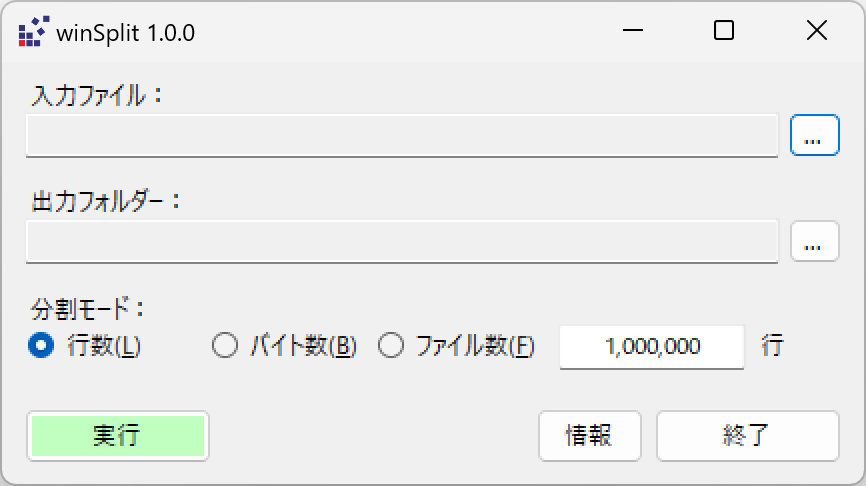

[English](./README.md)
# winSplit

## winSplitとは
- テキストのデータファイルを、1行を最小単位として分割できます。
- 分割は、最大行数、最大サイズ（バイト数）または最大ファイル本数を指定することができます。

## 適用
- Unix系OSの `split` が使用できない環境
- WindowsのPowerShellで `$i=0; cat .\src.log -ReadCount 1000000 | % { $_ > dest_$i.log; $i++ }` や `$i=0; Get-Content ALL.csv -ReadCount 1000000 | % {$_ | Out-File "sub_$i.csv" -Append; $i++}` を使えない環境

## インストール
[Installers](../installers/) からインストーラーをダウンロードし実行してください。

## 使い方
動作パラメーターを入力し実行ボタンを押してください。
|パラメーター名|入力方法|
| ----- | ----- | 
|入力ファイル| `...`ボタンから選択ダイアログを開く|
|出力フォルダー|`...`ボタンから選択ダイアログを開く|
|分割モード|行数 or バイト数 or ファイル数 を選択|
|分割値|行数 or バイト数 or ファイル数 を入力|

## エラーメッセージ
|メッセージ|対応|
| ----- | ----- |    
|入力ファイルが見つかりません。|入力ファイルを正しく指定する|
|入力ファイルに改行コードが見つかりません。|CR改行ファイルまたはバイナリーファイルを指定しない|
|入力ファイルの行の長さが異常です。|CR改行ファイルまたはバイナリーファイルを指定しない|
|入力ファイルが空です。|入力ファイルの内容を確認する|
|同名の出力ファイルが既に存在するため処理を中止しました。|出力フォルダー内の既存出力ファイルを退避する|
|想定されていないエラーが発生しました。以下のファイルを参照してください。|入力ファイルの内容を確認する。  issue登録する場合はダイアログで示されるエラー情報ファイルを添付|

## 多国語対応
- 起動時に、動作環境ロケールに合わせて以下の表示言語が選択されます。
- 実行時引数 `--locale en` `--locale zh_TW` などで指定することもできます。

|ロケール|言語|クオリティ|
| ----- | ----- | ----- |
|(default)|英語|AI翻訳|
|jp|日本語|ネイティブ|
|zh_TW|中国語（繁体字）|AI翻訳|
|zh|中国語（簡体字）|AI翻訳|
|ko|ハングル|AI翻訳|

## 製作のきっかけ
- マルチビーム測量の点群データが毎日100GB程度発生する現場担当者から行を考慮したファイル分割ソフトの照会があったが、WSLやMinGWなどのWindows上Unix環境を構築する時間や余裕がなく、また作業メンバーに取引先や自社事務員さんまで動員されておりPowerShellの起動やスクリプトの記述も困難と思われたため単体のWindowsソフトとして作成した。
- 照会を受けた時はsplitコマンドに`-l` `-b` オプションはあるが `-n`が無いと勘違いしてソフトを作成、しかし後日`-n`があると知り、主機能での特長が出せず残念なことに。。

## 開発環境
Visual Basic .NET / .NET 8 / Visual Studio 2022
まず winsplit.sln を開いてください。

## 協力/貢献
以下の協力/貢献を歓迎します。
- 動作不良の連絡
- 機能の要望、提案
- 言語の修正、追加要望
- プルリクエスト

連絡は、以下で受け付けます。
- Github: https://github.com/manojunichiro/winsplit
- Email: support_winsplit AT garagekids.jp 

## 謝辞
KOYA
