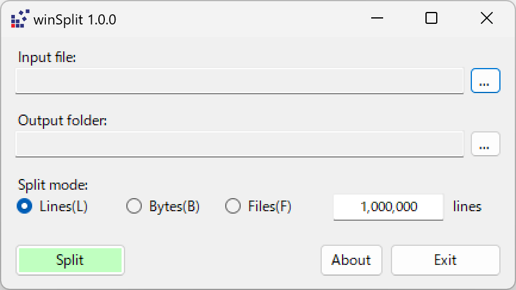

[日本語](./README-ja.md)
# winsplit

## What is winSplit
- The winSplit allows you to split data files into smaller units, with one line as the minimum unit.
- You can specify the splitting criteria based on maximum number of lines, maximum size (in bytes), or maximum number of files.

## Applicability
- Environments where Unix-based `split` command is not available.
- Environments where commands like `$i=0; cat .\src.log -ReadCount 1000000 | % { $_ > dest_$i.log; $i++ }` or `$i=0; Get-Content ALL.csv -ReadCount 1000000 | % {$_ | Out-File "sub_$i.csv" -Append; $i++}` cannot be used in Windows PowerShell.

## Installation
Please download the installer from [Installers](../installers/) and run it.

## How to Use
Enter the operational parameters and press the execute button.
|Parameter|Input Method|
| ----- | ----- | 
|Input File|Open selection dialog with `...` button|
|Output Folder|Open selection dialog with `...` button|
|Split Mode|Choose between lines, bytes, or file count|
|Split Value|Enter the value for lines, bytes, or file count|

## Error Messages
|Message|Action|
| ----- | ----- |    
|Input file not found.|Specify the input file correctly.|
|No newline found in the input file.|Do not specify a CR line feed file or a binary file.|
|Abnormal line length in the input file.|Do not specify a CR line feed file or a binary file.|
|Input file is empty.|Check the contents of the input file.|
|Processing was aborted because an output file with the same name already exists.|Back up existing output files in the output folder.|
|An unexpected error occurred. Please refer to the following file.|Check the contents of the input file.   If you are registering an issue, attach the error information file indicated in the dialog box.|

## Multilingual Support
- The display language will be selected based on the operating environment locale at startup.
- You can also specify the language at runtime with command line arguments like `--locale en`,  `--locale zh_TW` or else.

|Locale|Language|Quality|
| ----- | ----- | ----- |
|(default)|English|AI Translation|
|ja|Japanese|Native|
|zh_TW|Traditional Chinese|AI Translation|
|zh|Simplified Chinese|AI Translation|
|ko|Korean|AI Translation|

## Motivation for Development
- A field engineer responsible for multi-beam survey generates approximately 100GB of point cloud data daily. When seeking file splitting software that considers line-based segmentation, setting up a Windows-based Unix environment such as WSL or MinGW was challenging due to time and resource constraints. Additionally, even mobilizing the entire team, including business partners and in-house accountant, made it difficult to initiate PowerShell or script writing.
- When I received his inquiry, I initially misunderstood that the split command had options -l and -b but lacked -n, prompting me to start coding this software. However, I later discovered that -n indeed existed. Unfortunately, this oversight prevented me from highlighting the main feature of the software..

## Development Environment
Visual Basic .NET / .NET 8 / Visual Studio 2022
Please open winsplit.sln first.

## Collaboration/Contribution
We welcome the following collaborations/Contribution.
- Report of malfunctions
- Feature requests, suggestions
- Language corrections, addition requests
- Pull requests

We accept inquiries at the following.
- Github: https://github.com/manojunichiro/winsplit
- Email: support_winsplit AT garagekids.jp 

## Acknowledgments
KOYA.
